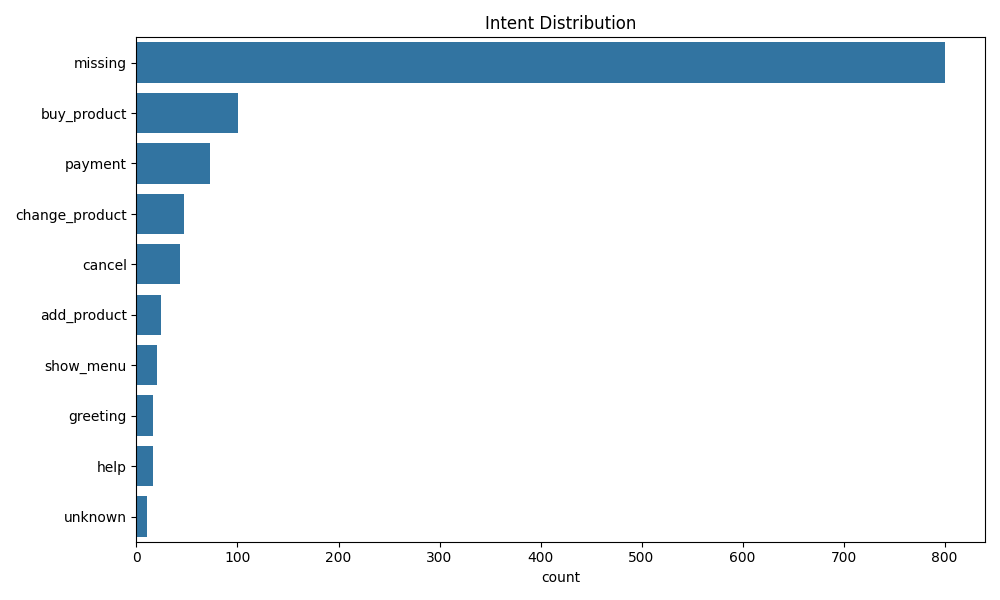
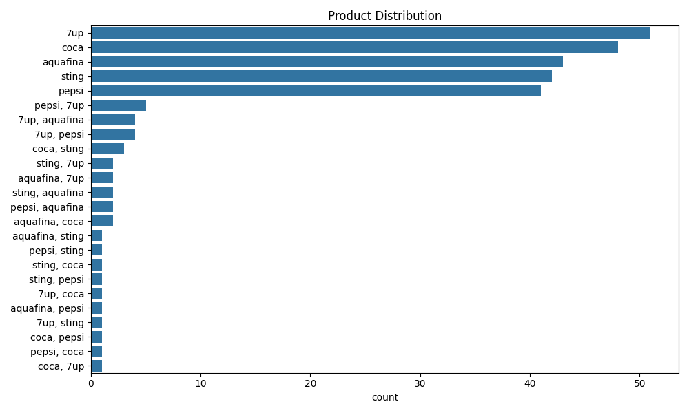
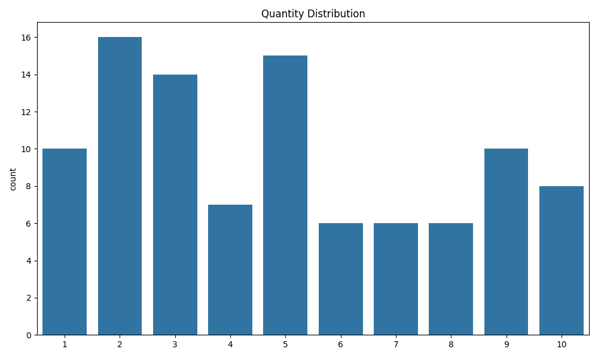
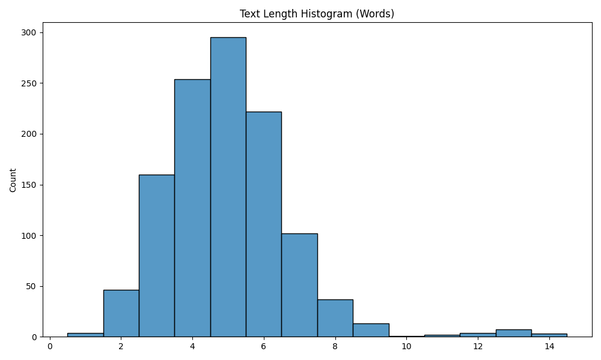

# Dataset Exploratory Data Analysis (EDA) Report

## 1. Overview
This report provides a comprehensive exploratory data analysis of the combined Vietnamese vending machine dataset (`dataset_final.jsonl` and `dataset_150_bonus_v2.jsonl`). The dataset is designed to train Spoken Language Understanding (SLU) models, extracting intents and entities from user queries that may include Automatic Speech Recognition (ASR) noise.

**Total Samples:** 1,150 utterances.

## 2. Distributions & Statistics

### 2.1. Intent Distribution
The dataset encompasses multiple intents to capture diverse user interactions. Excluding the 800 unlabeled samples, the distribution of the 350 gold-labeled samples is as follows:
- **buy_product:** 101 samples
- **payment:** 73 samples
- **change_product:** 47 samples
- **cancel:** 43 samples
- **add_product:** 24 samples
- **show_menu:** 20 samples
- **greeting:** 16 samples
- **help:** 16 samples
- **unknown:** 10 samples

*Observation:* `buy_product` and `payment` dominate the dataset, aligning with the primary use cases of a vending machine.

### 2.2. Product Distribution
Among the extracted entities, the occurrences of single catalog products are balanced:
- **7up:** 51
- **coca:** 48
- **aquafina:** 43
- **sting:** 42
- **pepsi:** 41

*Observation:* There is a long tail of "invalid" multi-product combinations (e.g., "pepsi, 7up") which need normalization or multi-entity support.

### 2.3. Quantity Distribution
Extracted quantities range from 1 to 10. 
- Highest frequencies: **2** (16 times), **5** (15 times), **3** (14 times).
- Lower frequencies: **7**, **8**, **6** (6 times each).

### 2.4. Text Length Statistics
The query lengths (in words) reflect short, direct voice commands:
- **Minimum:** 1 word
- **Maximum:** 14 words
- **Mean:** 4.99 words
- **Median:** 5.0 words

### 2.5. ASR Alias Statistics
A significant portion of the dataset includes ASR distortions. We tracked the presence of predefined ASR aliases within the raw text:
- **aqua fina:** 16 occurrences
- **xtinh:** 9 occurrences
- **seven up:** 7 occurrences
- **a qua phi na:** 5 occurrences
- **pep xi:** 2 occurrences
- **x ting:** 2 occurrences

*Observation:* The model must be robust to spacing ("aqua fina") and phonetical misspellings ("xtinh", "pep xi").

## 3. Pipeline Recommendations

To optimally leverage this data, we recommend the following pipeline for training and deployment:

### 3.1. Train/Val/Test Split
- **Test Set (15% - 50 samples):** Sampled strictly from the high-quality, manually verified data (e.g., the 150 bonus set) to ensure rigorous evaluation.
- **Validation Set (15% - 50 samples):** Sampled from the gold dataset for hyperparameter tuning.
- **Training Set (70% + Unlabeled):** The remaining 250 gold samples. The 800 unlabeled samples should be utilized via semi-supervised learning (pseudo-labeling).

### 3.2. Teacher-Labeling Pipeline
To handle the 800 unlabeled samples:
1. Train a strong "Teacher" model (e.g., fine-tuned PhoBERT or an LLM like GPT-4/Gemini via few-shot prompting) on the 350 gold samples.
2. Use the Teacher to infer intents and entities for the 800 unlabeled texts.
3. Filter the pseudo-labels based on a confidence threshold. Instances below the threshold should be sent for human review.

### 3.3. Student-Training Pipeline
1. Combine the 250 gold training samples and the high-confidence pseudo-labeled samples.
2. Train a lightweight "Student" model (e.g., JointBERT or a smaller bi-encoder architecture optimized for edge devices).
3. Apply knowledge distillation to transfer robustness from the Teacher to the Student, ensuring low-latency inference on the vending machine hardware.
